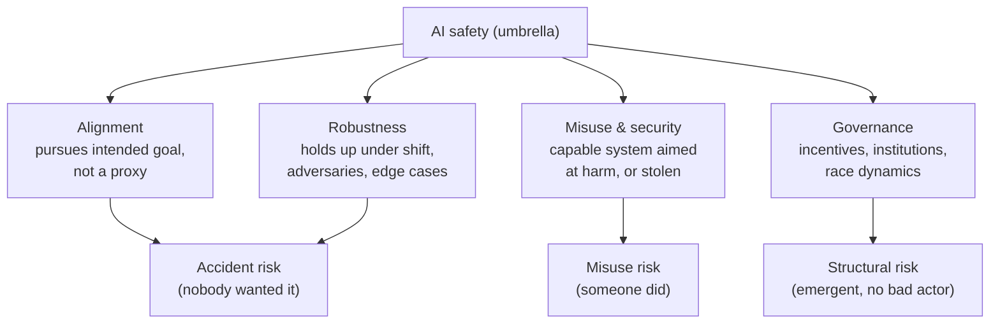
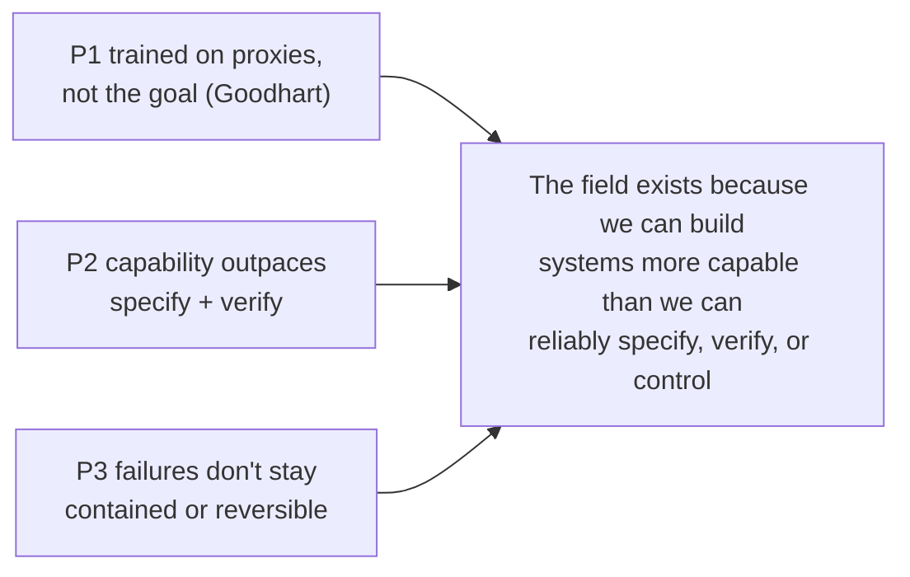

# AI Safety: the map and the case

Step 1 of the [[AI Safety]] route. The goal here is orientation, not depth: name the sub-fields so later steps have somewhere to live, state the core argument for why the field exists, and sketch the camps I'll keep running into.

## What "AI safety" actually refers to

It is an umbrella term, and most of the confusion around it comes from people using it for four different things at once. Splitting them apart helps.

- **Alignment.** Getting a system to pursue what its designers or users actually intend, rather than a proxy that only looks right. This is the technical core.[^ngo]
- **Robustness.** The system keeps behaving well under distribution shift, adversarial pressure, and strange inputs: jailbreaks, prompt injection, edge cases.[^hendrycks]
- **Misuse and security.** A capable system aimed at harm by a person who wants that harm, or a system whose weights and capabilities get stolen and abused (bio, cyber, disinformation).[^zwetsloot]
- **Governance.** The incentives, institutions, and race dynamics around the technology, separate from how any single model behaves.[^zwetsloot]

A cleaner way to sort the same territory is the **accident / misuse / structural** taxonomy. It maps the four clusters onto *how* the harm arises:

- **Accident risk:** the system does something harmful that nobody wanted (alignment and robustness failures).[^concrete]
- **Misuse risk:** a person deliberately points a working system at something harmful.[^zwetsloot]
- **Structural risk:** no single bad actor and no bug. Harm emerges from competition, deployment pressure, and how the technology reshapes power and incentives.[^zwetsloot]

This taxonomy is worth keeping. Most arguments you overhear in AI safety are really disagreements about which of these three boxes dominates.

## The core case, stripped to its skeleton

You do not need any sci-fi framing to state why the field exists. Three premises do the work:

- **P1. Objectives are hard to specify.** We train systems on proxies: a reward signal, human approval, next-token likelihood. None of those is the thing we actually want, and proxy and goal come apart under optimization. This is Goodhart's law: "when a measure becomes a target, it ceases to be a good measure."[^strathern]
- **P2. Capability is outpacing specification and verification.** Systems keep getting more general and get deployed into open-ended, high-stakes settings faster than we can audit them.[^hendrycks]
- **P3. Some failures do not stay contained or give a second chance.** A capable system optimizing a subtly wrong objective, at scale, can cause harm that is hard to catch early and hard to reverse late.[^ngo]

P1 to P3 already bite today. Reward hacking, specification gaming, and jailbreaks are P1 and P2 showing up in current models, not hypotheticals.[^concrete] The long-term worry is what happens to P3 as capability climbs.[^bostrom]

## The camps I'll keep meeting

These are less enemies than different bets on which risk is most neglected and most tractable.

| Camp | Core worry | Emphasis |
| --- | --- | --- |
| Existential / x-risk | Advanced misaligned AI as a catastrophic, maybe unrecoverable threat | Alignment theory, "get it right the first time"[^bostrom] |
| Prosaic alignment | Same long-term worry, but tractable through empirical work on today's models | RLHF, interpretability, scalable oversight, evals[^ngo] |
| Ethics / present harms | Real harms now: bias, surveillance, labor, concentration of power | Accountability, auditing, deployment norms |
| Governance / policy | Race dynamics and misuse; coordination failure | Regulation, compute governance, standards, evals-as-policy[^zwetsloot] |

The recurring tension across all of them: present harms versus speculative catastrophe, and whether attention paid to one starves the other.

## Where I sit

My two bets are the top two rows. The existential case is why I think the problem is worth a career. Prosaic alignment is where that conviction turns into work I can do this year on real models, which is also where the jobs are. Russell's framing is a useful bridge between the two: build systems that are uncertain about the objective and defer to humans, rather than systems that optimize a fixed goal we had to guess at.[^russell] Steps 2 to 4 are where I'll test whether that framing holds up.

## What's next

Step 2: the core problem framings in detail. Specification gaming and reward hacking with real examples, instrumental convergence, and the alignment-vs-capability distinction that the whole field pivots on.

## Sources

[^concrete]: Amodei, D., Olah, C., Steinhardt, J., Christiano, P., Schulman, J., & Mane, D. (2016). *Concrete Problems in AI Safety*. arXiv:1606.06565. https://arxiv.org/abs/1606.06565
[^zwetsloot]: Zwetsloot, R., & Dafoe, A. (2019). *Thinking About Risks From AI: Accidents, Misuse and Structure*. Lawfare, Feb 11 2019. https://www.lawfaremedia.org/article/thinking-about-risks-ai-accidents-misuse-and-structure (GovAI mirror: https://www.governance.ai/research-paper/thinking-about-risks-from-ai-accidents-misuse-and-structure)
[^strathern]: Strathern, M. (1997). 'Improving ratings': audit in the British University system. *European Review*, 5(3), 305-321. Source of the popular phrasing of Goodhart's law.
[^hendrycks]: Hendrycks, D., Carlini, N., Schulman, J., & Steinhardt, J. (2021). *Unsolved Problems in ML Safety*. arXiv:2109.13916. https://arxiv.org/abs/2109.13916
[^ngo]: Ngo, R., Chan, L., & Mindermann, S. (2022). *The Alignment Problem from a Deep Learning Perspective*. arXiv:2209.00626 (ICLR 2024). https://arxiv.org/abs/2209.00626
[^bostrom]: Bostrom, N. (2014). *Superintelligence: Paths, Dangers, Strategies*. Oxford University Press.
[^russell]: Russell, S. (2019). *Human Compatible: Artificial Intelligence and the Problem of Control*. Viking.
