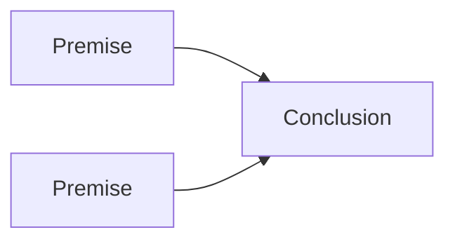

# Note style guide

A lightweight checklist for writing vault notes so they read like a person wrote them. This is a distillation of the full `humanizer` skill for everyday note-taking. Run the full skill only for anything headed to the public research garden.

## The short version

Write the way you would explain it to a sharp colleague. Vary sentence length. Have a view. Prefer the specific fact over the vague claim.

## Do

- Use plain verbs: `use` (not leverage/utilize), `is`/`has` (not serves as/boasts), `start` (not embark/commence).
- Lead with the point, then the evidence. No "let's dive in" or throat-clearing.
- Vary rhythm. Some sentences short. Some longer and unhurried.
- Take a position when the material warrants one, and flag uncertainty honestly.
- Keep specifics: numbers, names, dates, a page or section for a claim.
- Sentence case for headings (only the note title may be title case).
- Straight quotes, not curly.

## Avoid (the reliable AI tells)

- Tier-1 words: delve, landscape (metaphor), realm, robust, comprehensive, leverage, pivotal, underscores, seamless, tapestry, testament to, deep dive, unpack, intricate, holistic, actionable.
- Significance inflation: "marks a pivotal moment," "stands as a testament," "reflects a broader shift." If deleting the clause changes nothing, delete it.
- Em dashes. Target zero; use commas, periods, or parentheses instead.
- The rule of three ("innovation, inspiration, and insight") on repeat.
- Vague authority: "experts believe," "studies show," with no cite. Name the source or drop the claim.
- Empty conclusions: "the future looks bright," "only time will tell."
- Emoji in headings, decorative bold, and mechanical `**Header:** restates header` lists.

## Citations in this vault

Use Markdown footnotes. They render in Obsidian as clickable superscripts that jump to the source list and back.

- Put a numbered marker at the end of the clause or sentence it supports: `... claim.[^1]`
- Collect the definitions in a `## Sources` (or `## Notes and sources`) block at the end: `[^1]: Author (year). Title. Venue. URL`
- Named keys are fine and more stable than numbers: `[^ngo]` renders as its own footnote number but survives reordering.
- Prefer a primary source with a canonical URL or DOI. Never invent citation metadata; if a field is unknown, say so.

Example:

```
Systems are trained on proxies, not the goal they are meant to serve.[^goodhart]

## Sources
[^goodhart]: Strathern, M. (1997). 'Improving ratings': audit in the British University system. European Review, 5(3), 305-321.
```

## Diagrams

Obsidian renders Mermaid from a fenced ` ```mermaid ` block. Reach for one when a relationship is clearer as a picture than a paragraph.

- Flowchart for taxonomies, pipelines, and argument chains (`flowchart TD` / `LR`).
- Use `<br/>` for line breaks inside a node label, and wrap labels in quotes.
- Mermaid has no native Venn diagram. For overlapping sets, either map the relationship as a flowchart or use a plain table.



## Sources

- Distilled from the `humanizer` skill (Wikipedia "Signs of AI writing" + tiered-vocabulary research).
- [[templates/Templates|Templates]]
